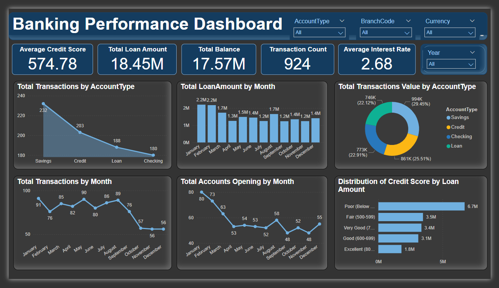

# SBI Banking Insights & DAX Analytics



## Project Overview
This project analyzes banking transaction data and customer profiles to uncover key patterns and trends in banking behavior. Utilizing Power BI and DAX, an interactive dashboard was developed to visualize critical insights, optimize branch performance, and improve customer segmentation.

## Industry Context
In the competitive banking sector, understanding customer behavior and managing financial risk are vital for growth and profitability. This project focuses on analyzing banking data to provide insights into branch performance, loan management, and customer engagement strategies.

## Primary Objective
To analyze transactional trends and customer profiles to provide actionable insights, using Power BI for data visualization and DAX for advanced analytics.

## Dataset Description
- **Banking Transactions Dataset**: Contains information on transaction types, amounts, dates, times, and branch codes.
- **Customer Account Details Dataset**: Includes data on account balances, interest rates, credit scores, and loan amounts.
- **Combined Dataset**: Roughly 1,500 rows and 16 columns.

## Data Preprocessing
- **Data Cleaning**: Addressed missing values, removed duplicate entries, and irrelevant data.
- **Merging**: Datasets were merged on the `AccountNumber` column for a unified view.
- **Data Type Conversion**: Date columns were formatted correctly, and account holder details were split into separate fields for more granular insights.

## Actionable Insights
- **Peak Transaction Hours**: High activity observed between 7 AM, 10 AM, 11 AM, and 3 PM.
- **Seasonal Trends**: Lower transaction activity in October, November, and December.
- **Loan Analysis**:
    - Poor credit score customers had higher loan activity but took smaller loans.
    - Excellent credit score customers had fewer but larger loans.
- **Popular Account Type**: Savings accounts were the most frequently used across all branches.

## Key Results
- Built an interactive **Power BI Dashboard** displaying customer behaviors and branch performance.
- Applied **DAX** calculations for insights on average balances, loan trends, and the impact of credit scores on loan amounts.
- Conducted branch performance analysis, identifying over-performing and under-performing branches.

## How to Use
1. Clone this repository to your local machine.
   ```bash
   git clone https://github.com/shreya1m/Banking-Insights-DAX-Analytics.git
    ```
3. Open the provided `.pbix` file in Power BI to explore the interactive dashboard and perform your own analyses.
4. Ensure your dataset structure aligns with the model used in the project for accurate results.

## Files in the Repository
- `PowerBI_Dashboard.pbix`: The Power BI file containing the dashboard.
- `README.md`: This documentation file.
- `BankingDataset1.xlsx`: File containing the raw banking dataset 1 used in the analysis.
- `BankingDataset2.xlsx`: File containing the raw banking dataset 2 used in the analysis.
- `Banking_PowerBI_Documentation.pdf`: Detailed description of all the analysis , DAX calculation used in the Datasets.
- `Data_Info_pbi.pdf`: Datasets feilds and their description.
- `Banking Project Power BI-Part 1.pbix`: Power BI file containing all charts, analyses, and calculations used for data exploration and insights.
- `Banking_Dashboard.pbix`: Power BI file containing the final interactive dashboard with key visualizations and analyses used in the dashboard.
## Future Work
- Extend analysis to incorporate customer feedback and satisfaction metrics.
- Integrate more detailed financial metrics, such as interest earned on loans or penalties on overdue payments.
- Perform predictive modeling to forecast future transaction trends and loan defaults.
